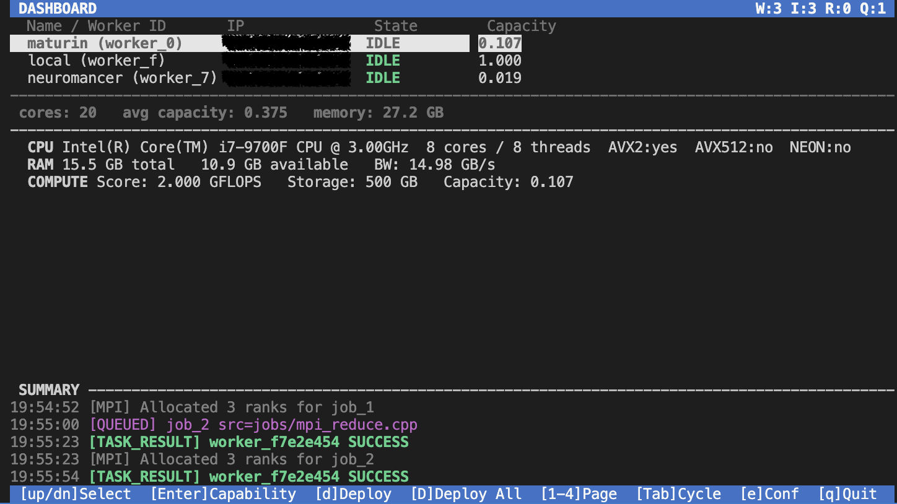

# CLUSTR

A distributed HPC job scheduler. A central scheduler dispatches compile-and-run jobs to remote worker nodes over a custom binary TCP protocol. The scheduler has a live ncurses TUI; workers are deployed inline from the TUI with no separate terminal required.



Supports both single-node jobs and multi-node **MPI-style parallel jobs** using a built-in custom MPI implementation — no external MPI library required.

---

## Requirements

| Machine | Requirement |
| --- | --- |
| Scheduler (your Mac) | CMake >= 3.20, Clang/GCC with C++20, ncurses |
| Worker nodes | g++ (installed automatically by setup_worker.sh), SSH access |

ncurses ships with macOS. On Linux: `sudo apt install libncurses-dev`.

---

## Build (scheduler machine only)

```bash
git clone <repo>
cd HPC-CLUSTER

cmake -B build
cmake --build build/
```

This produces two binaries in `build/`:

| Binary | Purpose |
| --- | --- |
| `build/scheduler` | Runs on your machine — TUI + job dispatch |
| `build/worker` | **Not used directly.** Workers are compiled natively on each remote node by `deploy.sh`. |

---

## Configuration

All cluster settings live in a single file: `system.conf`.

```ini
# Scheduler identity — written to each worker so they know where to connect back
scheduler_ip=192.168.1.10       # IP of THIS machine (must be reachable by workers)
scheduler_port=9999

# Defaults inherited by every worker section
ssh_key_path=~/.ssh/id_rsa
remote_install_path=/var/tmp/clustr_worker
work_dir=/tmp/clustr

# One section per worker node
[worker-a]
deploy_host=192.168.1.20        # must be an IP, not a hostname
deploy_user=alice

[worker-b]
deploy_host=192.168.1.21
deploy_user=alice
```

`deploy_host` and `deploy_user` are required per worker. All other fields fall back to the global defaults above.

---

## Worker setup (one-time per cluster)

Run this once from your local terminal before using the TUI. It handles SSH key generation, key distribution, and build tool installation for every worker in `system.conf`:

```bash
./scripts/setup_worker.sh
# or with an explicit config path:
./scripts/setup_worker.sh /path/to/system.conf
```

What it does for each worker:

1. Generates an SSH key pair locally at `ssh_key_path` — skipped if one already exists
2. Copies the public key to the worker — enter the worker's **login password** once
3. Installs `g++` on the worker if missing

After this completes, all future operations — deploy, log tailing, job execution — are fully non-interactive.

---

## Running

### 1. Start the scheduler

```bash
./build/scheduler
# or with an explicit config path:
./build/scheduler /path/to/system.conf
```

The TUI launches immediately. Workers listed in `system.conf` appear as **OFFLINE** until deployed or connected.

### 2. Deploy workers

Navigate to the **Workers** page (`3`) or **Dashboard** (`1`), select an **OFFLINE** worker with arrow keys, press `d`, and confirm with `y`. Deploy output streams live in the log panel.

Press `D` (capital) from any page to deploy all known workers in parallel.

**Manual deploy** (if you prefer the terminal):

```bash
./scripts/deploy.sh system.conf
```

Multiple deploys to different hosts run safely in parallel — each deploy uses a unique temporary path so they do not interfere with each other.

### 3. Submit a job

Navigate to the **Jobs** page (`2`). Select a `.cpp` file from the `jobs/` browser with arrow keys and press `Enter`.

The submit dialog presents three preset compile commands you can cycle through with `up`/`down`:

| Preset | Compile command |
| --- | --- |
| **MPI** (default) | Full ASIO/MPI flags, links against `/var/tmp/clustr/include` and `/var/tmp/clustr/asio_include` |
| **Simple** | `g++ -O2` — for plain single-node jobs with no dependencies |
| **Opt** | `g++ -std=c++20 -O3 -march=native` — optimized native build |

Press `Enter` to accept the preset or type a custom command. Set **Ranks** to `1` for a single-node job or `N` for a parallel MPI job across N workers.

---

## Job scheduling

### How jobs are queued

Every submitted job enters a **job queue**. The scheduler's `try_schedule()` loop runs after every state change (job submit, job complete, worker connect). It scans the queue front-to-back and dispatches jobs as workers become available.

### Scheduling strategies

| Strategy | Behaviour |
| --- | --- |
| `FirstAvailable` | FIFO — dispatch to the first idle worker (default) |
| `CapacityWeighted` | Prefer the highest-capacity worker (GFLOPS + memory bandwidth score) |
| `RoundRobin` | Cycle through idle workers evenly |
| `Manual` | No auto-dispatch — all assignments done via `[f]` Force-assign |

Press `S` on the Jobs or Workers page to switch strategy at runtime without restarting the scheduler.

### Single-node jobs

The scheduler picks one idle worker using the active strategy, sends the source file, compiles it on the worker, and runs it. On exit the worker reports `TASK_RESULT` and returns to idle.

### MPI parallel jobs

When **Ranks > 1**, the scheduler waits until N idle workers are available, then runs a two-phase setup before executing:

```text
Phase 1 — Port discovery
  Scheduler sends PEER_ROSTER (partial) to each worker
  Each worker binds a TCP listener on port 0 (OS-assigned)
  Each worker sends PEER_READY with its assigned port

Phase 2 — Execution
  Scheduler sends complete PEER_ROSTER (all ports known) to each worker
  Each worker writes /var/tmp/clustr/mpi_roster.conf
  Scheduler sends FILE_DATA + EXEC_CMD to all workers simultaneously
  Workers execute — peer TCP mesh established by the MPI runtime
```

All N workers run the same binary. Rank 0 reports the final `TASK_RESULT`; ranks 1..N-1 report `RANK_DONE`. All N workers return to idle together.

---

## Custom MPI API

`include/clustr_mpi.h` is a header-only MPI implementation built on C++20 coroutines and ASIO TCP. Include it in any job file — no external library, no `mpirun`.

### Entry point

```cpp
#include "clustr_mpi.h"

CLUSTR_MPI_MAIN(mpi) {
    // mpi is a clustr::MPI& — fully connected before this body runs
    co_return 0;
}
```

The macro expands to `int main()` + ASIO io_context setup + peer mesh connection + coroutine dispatch.

### Point-to-point

```cpp
co_await mpi.send(data, dst_rank, tag);          // std::vector<T>
auto v = co_await mpi.recv<T>(src_rank, tag);    // returns std::vector<T>
```

`T` must be trivially copyable. `tag` defaults to 0.

### Collectives

```cpp
// Barrier — all ranks synchronize
co_await mpi.barrier();

// Broadcast — root sends, all receive in-place
co_await mpi.bcast(data, /*root=*/0);

// Reduce — result on root only
auto result = co_await mpi.reduce(data, clustr::ReduceOp::SUM, /*root=*/0);
// Supported ops: SUM, MIN, MAX, PROD

// Scatter / Gather
auto chunk = co_await mpi.scatter(data, /*root=*/0);
auto full  = co_await mpi.gather(chunk, /*root=*/0);

// Allreduce — result available on all ranks
auto result = co_await mpi.allreduce(data, clustr::ReduceOp::SUM);
```

### Compile command (auto-filled by TUI)

```bash
g++ -std=c++20 -O2 -DASIO_STANDALONE -DASIO_NO_DEPRECATED \
    -I/var/tmp/clustr/include -I/var/tmp/clustr/asio_include \
    myjob.cpp -o myjob -lpthread
```

Headers are installed to `/var/tmp/clustr/` on each worker by `deploy.sh` and persist across reboots.

### Example jobs

| File | What it demonstrates |
| --- | --- |
| `jobs/mpi_hello.cpp` | Rank identity, barrier |
| `jobs/mpi_reduce.cpp` | Distributed sum via reduce + broadcast |
| `jobs/mpi_scatter_gather.cpp` | Scatter work chunks, parallel compute, gather results |

Submit any of these from the Jobs page with **Ranks** set to the number of workers you want to use.


For full protocol details see [`docs/MPI.md`](docs/MPI.md).

---

## Distributed Multidimensional FFT

This project includes a parallel FFT implementation for distributed multidimensional arrays using the algorithm from [FAST-FFT.md](docs/FAST-FFT.md).

**Status:** Phase 7 (2D slab FFT) complete and validated.

**Test examples:**
- `jobs/fft_serial_test.cpp` — baseline serial transform (PocketFFT)
- `jobs/subarray_coalesce_test.cpp` — zero-copy geometry validation
- `jobs/redistribute_test.cpp` — phase 6: axis redistribution
- `jobs/fft_2d_test.cpp` — phase 7: parallel 2D slab FFT

Run local validation with `tests/run_fft_2d_local.sh` (localhost oversubscription, all 4 compile-time presets, ranks 2/3/4/8).

For implementation details, architecture decisions, and design rationale see [`docs/MD-FFT.md`](docs/MD-FFT.md).

---

## TUI pages

Navigate with `1` `2` `3` `4` or `Tab`.

### Page 1 — Dashboard

Overview of all workers with a cluster stats bar (total cores, average capacity, total memory). Arrow keys to select, `Enter` to expand the hardware capability report, `d` to deploy selected worker, `D` to deploy all.

### Page 2 — Jobs

File browser of `jobs/*.cpp`. `Enter` on a file opens the submit dialog. Log panel below shows output for the selected file's most recent run.

| Key | Action |
| --- | --- |
| `Enter` | Submit selected job |
| `S` | Change scheduling strategy |
| `f` | Force-assign a queued job to a specific worker |
| `r` | Refresh job file list |
| `PgUp`/`PgDn` | Scroll log panel |

### Page 3 — Workers

Full worker management. Log panel below shows logs filtered to the selected worker.

| Key | Action |
| --- | --- |
| `d` | Deploy / re-deploy selected worker |
| `D` | Deploy all known workers |
| `k` | Kill running job on selected worker |
| `s` | Request live CPU/memory status |
| `S` | Change scheduling strategy |

### Page 4 — Logs

Full scrollable log. Toggle category filters: `j` Job, `w` Worker, `n` Network, `h` Heartbeat, `d` Deploy. `g` jumps to the latest entry.

### Global keys

| Key | Action |
| --- | --- |
| `1`-`4` | Jump to page |
| `Tab` | Cycle pages |
| `e` | Edit `system.conf` inline |
| `D` | Deploy all workers |
| `q` | Quit |

---

## Project structure

```text
system.conf              # cluster configuration (edit this)
jobs/                    # job source files (.cpp)
  mpi_hello.cpp          # MPI example: rank identity + barrier
  mpi_reduce.cpp         # MPI example: distributed reduce
  mpi_scatter_gather.cpp # MPI example: scatter/compute/gather
docs/
  MPI.md                 # Full MPI protocol and API documentation

server/main.cpp          # scheduler entry point
src/scheduler.cpp        # Scheduler class — dispatch, MPI group setup, message handling
src/tui/
  tui_state.cpp          # TuiState, Tui construction, shared helpers
  tui_draw.cpp           # per-page draw functions
  tui_input.cpp          # handle_key, per-page input handlers
  tui_dialogs.cpp        # modal dialogs (submit, deploy, config, strategy)
  tui_impl.h             # private helpers (color pairs, pad, log_color)

client/client.cpp        # Worker binary — connects to scheduler, executes jobs,
                         # handles PEER_ROSTER for MPI group setup
scripts/
  setup_worker.sh        # One-time worker setup (SSH keys, build tools)
  deploy.sh              # Bootstrap a remote worker node over SSH

include/
  protocol.h             # Binary wire protocol (message types, payloads, MPI messages)
  scheduler.h            # Scheduler class definition
  system_conf.h          # system.conf parser (SystemConf, KnownWorker)
  tui.h                  # TUI class, TuiState, TuiCommands, Page, LogCategory
  scheduler_strategy.h   # Pluggable strategy interface + Job struct (num_ranks)
  worker_registry.h      # WorkerEntry (peer_port), WorkerRegistry, WorkQueue
  clustr_mpi.h           # Header-only MPI runtime (include in job files)

src/                     # Library implementations
  protocol.cpp
  tcp_server.cpp
  capability_detector.cpp
  file_transfer.cpp
  remote_exec.cpp
  process_monitor.cpp
```

---

## Worker lifecycle

### Single-node job

```text
Connect -> HELLO -> HELLO_ACK -> CAPABILITY_REPORT
  -> [idle, heartbeating every 5s]
  -> FILE_DATA -> FILE_ACK
  -> EXEC_CMD (compile, sync) -> EXEC_RESULT
  -> EXEC_CMD (run, async) -> PROCESS_SPAWNED
  -> [job runs...]
  -> TASK_RESULT -> [back to idle]
```

### MPI parallel job (N ranks)

```text
[All N workers simultaneously:]
  -> PEER_ROSTER (partial, ports=0)
  -> [bind peer listener on OS-assigned port]
  -> PEER_READY (peer_port)
  -> PEER_ROSTER (complete, all ports known)
  -> [write /var/tmp/clustr/mpi_roster.conf]
  -> FILE_DATA -> FILE_ACK
  -> EXEC_CMD (run, async) -> PROCESS_SPAWNED
  -> [job runs, peer mesh established by clustr_mpi.h]
  -> rank 0:   TASK_RESULT -> [back to idle]
  -> rank 1..N: RANK_DONE  -> [back to idle]
```

Worker logs are written to `/tmp/clustr_worker.log` on each remote machine.

```bash
# Tail worker logs from your machine
ssh <user>@<worker-ip> 'tail -f /tmp/clustr_worker.log'

# Stop a worker manually
ssh <user>@<worker-ip> 'pkill -f /var/tmp/clustr_worker'
```
